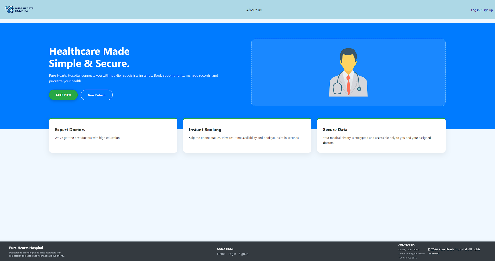
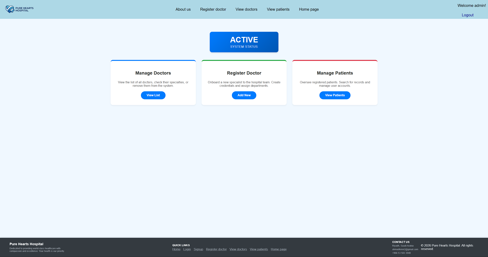
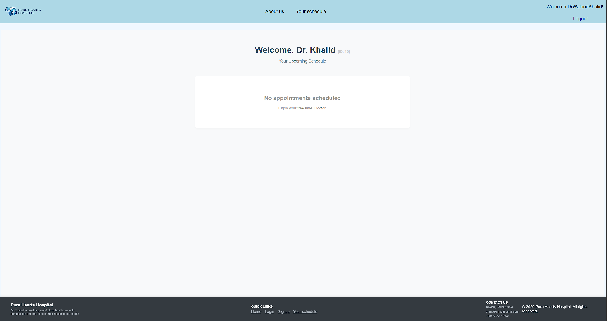
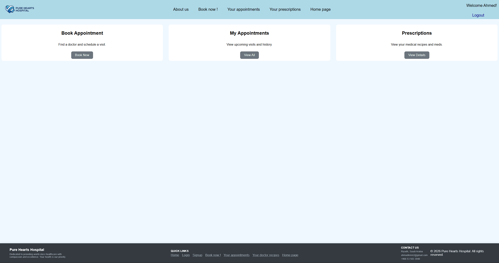
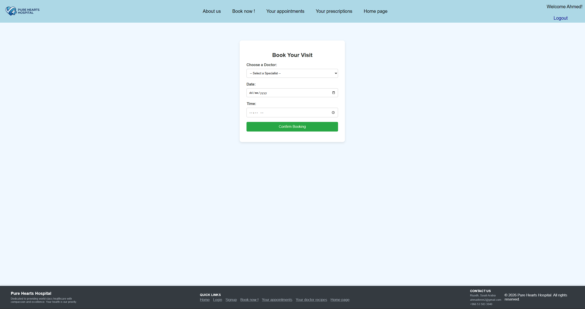
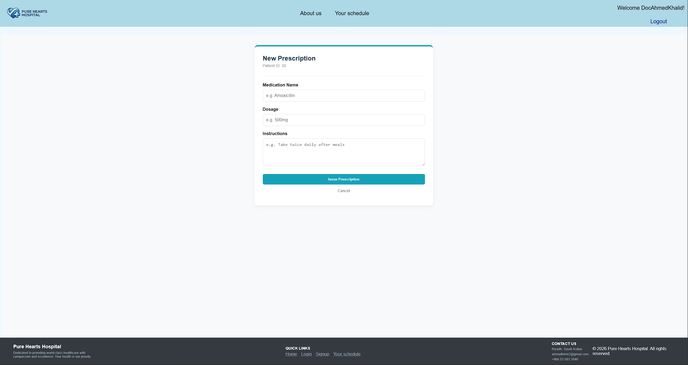
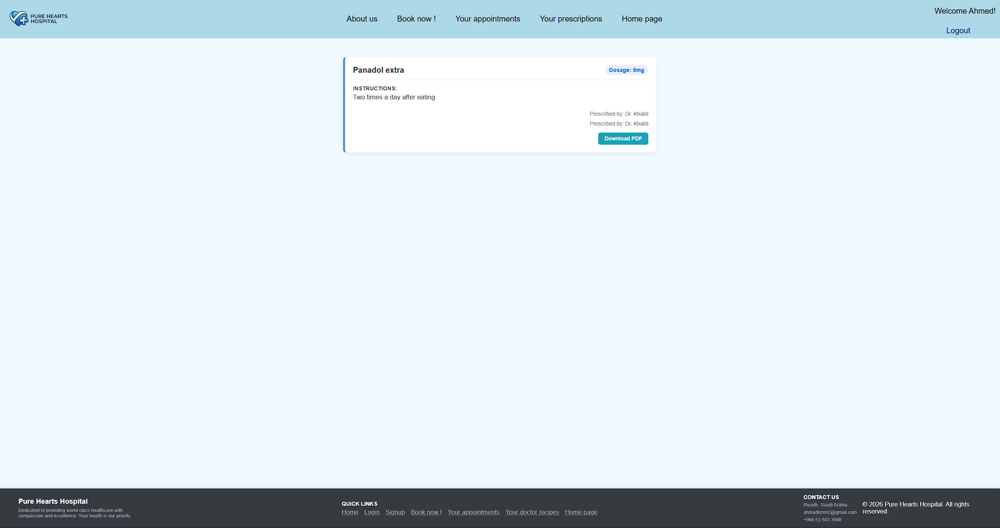

# Hospital Management System (HMS-Web)

A comprehensive, MVC-based web application designed to streamline the daily operations of "Pure Hearts Hospital." Built entirely on a raw Java technology stack (Servlets, JSP, JDBC), this system demonstrates a robust understanding of core web development, database architecture, and secure role-based access control without relying on heavy frameworks.

## Version 3.0: Core Architecture
The foundational release focused on establishing the MVC architecture, database connectivity, and role-based workflows for three distinct user types.

### 1. Administrator Module
* **System Dashboard:** High-level overview of hospital statistics and staff status.
  
* **Doctor Management:** Register new doctors into the system and discharge existing ones.
* **Patient Oversight:** View the complete list of registered patients and manage their system access.

### 2. Doctor Module
* **Personal Dashboard:** A secure, private view for doctors to manage their daily workflow.
  
* **Appointment Timeline:** A visual schedule of upcoming appointments sorted by time.
* **Cancellation Control:** Autonomy to cancel appointments directly from the dashboard to manage availability.

### 3. Patient Module
* **User Registration & Dashboard:** Secure sign-up, login functionality, and a personal hub.
  
* **Appointment Booking:** Patients can browse available doctors and seamlessly book appointments.
  
* **History Management:** View a list of upcoming appointments with the option to cancel them if needed.

## Version 3.1: Security & Medical Records (Full Version)
The V3.1 update transforms the system from a scheduling tool into a full-fledged medical management platform, heavily upgrading security and introducing end-to-end prescription handling.

### Server-Side Enhancements
* **BCrypt Password Encryption:** Integrated the `jbcrypt` library to hash and securely store all user passwords, ensuring data protection against database breaches.
* **Prescription Data Management:** Engineered new DAOs (`PrescriptionsDAO`) and Servlets to handle the complex relational mapping between doctors, patients, and medical records.
* **Dynamic PDF Generation:** Implemented the `openpdf` library to dynamically generate downloadable, formatted PDF prescription files directly from the server.

### Client-Side Enhancements
* **Doctor Prescription Interface:** A new interactive UI allowing doctors to write, review, and issue prescriptions to patients directly following an appointment.
  
* **Patient Medical History:** Patients now have a dedicated view to check their past prescriptions and securely download official PDF copies for their personal records.
  

## Technology Stack

* **Backend:** Java (Jakarta EE 10), Servlets, JSP
* **Database:** MySQL 8.0+
* **Data Access:** JDBC, Custom GenericDAO Implementation, HikariCP Connection Pooling
* **Security & Utilities:** BCrypt (Encryption), OpenPDF (Document Generation)
* **Frontend:** HTML5, CSS3 (Mobile Responsive)
* **Server:** Apache Tomcat 10.1+

## Setup and Installation

### Option 1: Quick Install via Snapshot Release (Recommended)
If you want to run the application immediately without compiling the source code, use the pre-built snapshot release.

1. **Download the Release:** Go to the [Releases](#) tab of this repository and download the latest `HMS-Web-1.0-SNAPSHOT.war` file.
2. **Database Setup:** * Create a MySQL database named `hospitalmanagement`.
    * Execute the schema scripts provided in the `database/` directory to create the tables.
3. **Environment Variables:** Set the following system environment variables for secure database access:
    * `DB_URL`: `jdbc:mysql://localhost:3306/hospitalmanagement`
    * `DB_USER`: Your MySQL username
    * `DB_PASSWORD`: Your MySQL password
4. **Deploy:** Copy the `.war` file into the `webapps` folder of your Apache Tomcat 10+ installation and start the server. The application will be live at `http://localhost:8080/HMS-Web`.

### Option 2: Build from Source
1. Clone the repository to your local machine.
2. Configure the database and environment variables as described in Option 1.
3. Open the project in your preferred IDE (IntelliJ IDEA Ultimate or Eclipse).
4. Build the project using Maven (`mvn clean install` or using the provided Maven wrapper `mvnw`).
5. Deploy the exploded artifact to your local Tomcat server.

## Engineering Takeaways
Building this project via a raw, framework-less approach yielded deep technical insights:
* **Servlet Routing:** URLs must be mapped to the Servlet controller, not the JSP view. Understanding this distinction is crucial for enforcing the MVC pattern.
* **State Management:** Setting errors in the `Session` causes them to persist across unintended pages. Scoping error messages to the `Request` object ensures they only appear where relevant.
* **State Updates via Redirection:** After executing a deletion (e.g., `DeleteAppointmentServlet`), redirecting the user back to their current view ensures the UI fetches the freshly updated database state.
* **Relational Integrity:** Deleting a database entity containing a Foreign Key (like `user_id`) requires cascading logic to delete the associated User entity to prevent orphaned records.
* **Debugging Philosophy:** Sometimes, stepping through the specific method that "should work" reveals subtle logic flaws that stack traces miss.

## Q&A
* **Why use raw Servlets instead of a modern framework like Spring Boot?** * *Answer:* This project was purposefully built without Spring to master the underlying fundamentals of Java web development. Understanding HTTP lifecycle, raw JDBC, and manual MVC separation makes transitioning to high-level frameworks much easier later.
* **Why are there no nurses in the system role hierarchy?**
    * *Answer:* To maintain project scope and adhere to the Single Responsibility Principle, the system focuses purely on the core interaction that drives a hospital visit: the Doctor-Patient relationship.
* **Are there plans for future refactoring?**
    * *Answer:* Yes. Early iterations prioritized getting comfortable with the JSP/Servlet environment over strict adherence to Clean Code. Future versions will focus on refactoring messy methods and better enforcing the Single Responsibility Principle (SRP).

## License
This project is open-source and available for educational purposes.